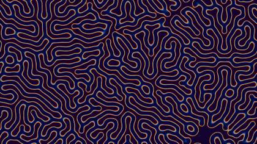
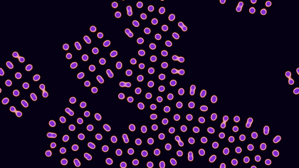
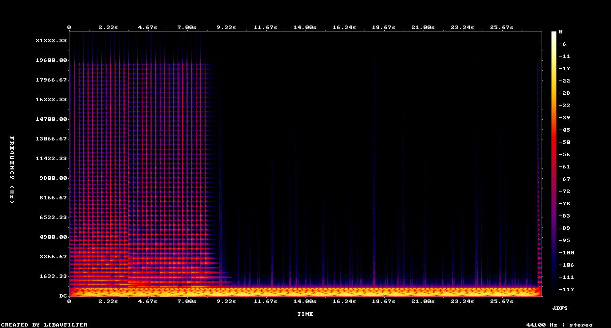
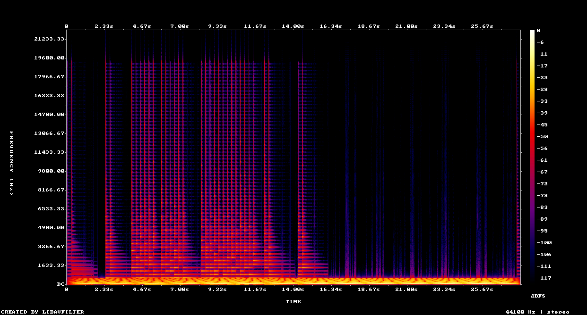
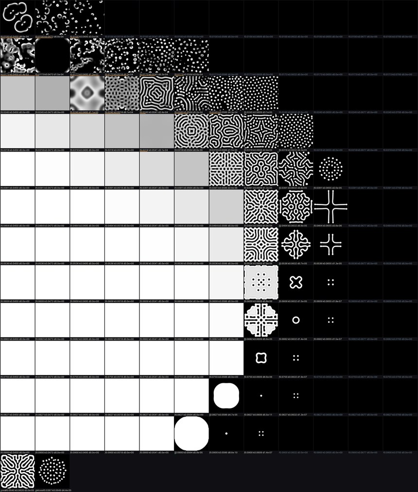

# Reaction-Diffusion Simulation

Two 28-second audiovisual demos grown from the **same two-line chemical equation** —
`coral` (labyrinthine growth) and `mitosis` (dividing cells). Every pixel and every
audio sample is generated from code. No illustration, no sample libraries, no GPU:
just numpy, the Python standard library, and ffmpeg. A second script maps the rest of
the same equation's pattern space — see [The pattern sweep](#the-pattern-sweep).

| coral | mitosis |
|:--:|:--:|
|  |  |
| `f = 0.0545`, `k = 0.062` | `f = 0.0367`, `k = 0.0649` |
| ▶ [**coral.mp4**](coral.mp4) — full quality, 960×540, with audio | ▶ [**mitosis.mp4**](mitosis.mp4) — full quality, 960×540, with audio |

*The GIFs above are silent 5-second excerpts. Click the mp4 links for the full 28
seconds with sound — the audio is half the piece.*

📖 **[Read the full illustrated write-up →](https://claude.ai/code/artifact/9b418ffe-04e9-4751-b4a0-026563f84b08)**
(tabbed, with both videos playable inline; also in this repo as
[`documentation.html`](documentation.html) — download and open locally)

## Quick start

```bash
python demo.py --selftest   # sanity check: the sim stays finite and doesn't flatline
python demo.py all          # renders coral.mp4 and mitosis.mp4 (~11 min total)
python demo.py b --preview  # fast gate: 4 PNG stills, no encode — catches dead sims
```

The parameter sweep is a second script. It never modifies `demo.py` — it carries its
own batched stepper and imports `demo` only as the reference its selftest checks against:

```bash
python sweep.py --selftest              # all three checks, seconds
python sweep.py --stage1                # 12×12 f-k contact sheet (~21 min)
python sweep.py --stage1 --ratio 0.3    # same sheet at another diffusion ratio
python sweep.py --stage2                # designed seeds + glider detector (~25 min)
python sweep.py --stage4                # 4 near-misses, 40 000 steps (~2 min)
python sweep.py --stage5                # fine k rescan, 162 tiles (~73 min)
```

Requires Python 3.10+, `numpy`, and an `ffmpeg` binary on `PATH`.
`sweep.py` also needs `scipy`, `Pillow` and `matplotlib`.
Built and verified on Python 3.13.5 / numpy 2.2.6 / scipy 1.16.0 / Pillow 11.0.0 /
ffmpeg 7.1.1, Windows 11.

## The math

Both demos run the **Gray-Scott reaction-diffusion system**: two virtual chemicals,
$u$ and $v$, diffusing across a grid and reacting wherever they meet.

$$\frac{\partial u}{\partial t} = D_u \nabla^2 u - uv^2 + f(1-u)$$

$$\frac{\partial v}{\partial t} = D_v \nabla^2 v + uv^2 - (f+k)v$$

| symbol | meaning | value |
|---|---|---|
| $u, v$ | chemical concentrations, per grid cell | evolved |
| $D_u, D_v$ | diffusion rates | `1.0`, `0.5` |
| $f$ | **feed** rate — replenishes $u$ | per-demo |
| $k$ | **kill** rate — removes $v$ | per-demo |
| $uv^2$ | the reaction: two $v$ convert one $u$ into a third $v$ | — |

$v$ diffuses at **half** the rate of $u$, and that asymmetry is the entire trick.
Turing showed in 1952 that two substances reacting and diffusing at *different* rates
can spontaneously break spatial symmetry and self-organize into stripes, spots, or
branching mazes — with no pattern encoded anywhere except the rate constants.

The Laplacian $\nabla^2$ is discretized as a 9-point stencil:

$$\nabla^2 Z_{x,y} \approx -Z_{x,y} + 0.2 \sum_{\text{orthogonal}} Z + 0.05 \sum_{\text{diagonal}} Z$$

applied with `np.roll`, which wraps the grid into a **torus** — patterns exiting one
edge re-enter the opposite one, so there are no hard walls. Integration is explicit
Euler; one step per rendered frame is imperceptible at this discretization, so the
sim runs 20–30 physics steps per video frame.

```python
def laplacian(Z):
    return (-Z
            + 0.2 * (np.roll(Z, 1, 0) + np.roll(Z, -1, 0)
                     + np.roll(Z, 1, 1) + np.roll(Z, -1, 1))
            + 0.05 * (np.roll(Z, (1, 1), (0, 1)) + np.roll(Z, (1, -1), (0, 1))
                      + np.roll(Z, (-1, 1), (0, 1)) + np.roll(Z, (-1, -1), (0, 1))))

def step(u, v, f, k):
    uvv = u * v * v
    u += 1.0 * laplacian(u) - uvv + f * (1.0 - u)
    v += 0.5 * laplacian(v) + uvv - (f + k) * v
    np.clip(u, 0, 1, out=u)
    np.clip(v, 0, 1, out=v)
```

### Why two demos from one equation

`coral` and `mitosis` share **every line of code**. They differ only in the
`(f, k)` pair, which places each one in a different region of Pearson's 1993
classification of Gray-Scott regimes:

- **coral** — `f=0.0545, k=0.062`. Branching, labyrinthine growth that fills the grid.
- **mitosis** — `f=0.0367, k=0.0649`. A spot grows until its center goes unstable and
  pinches into two daughter spots, repeatedly. **There is no "split" logic in the
  code** — division is emergent from the same two equations.

Raising $k$ by ~0.003 and lowering $f$ by ~0.018 is the whole difference between
"coral reef" and "cells dividing."

## Sound

The audio is derived from the simulation itself — not composed alongside it. Two
per-frame statistics are recorded during the sim and drive everything:

1. **Total activity** $\sum v$ → the drone's amplitude envelope.
2. **Spatial centroid** of $v$ along $x$ → pluck pitch and stereo pan.

The drone is a detuned stack of sine harmonics plus a fifth. Plucks are
**Karplus-Strong** synthesis — a burst of white noise in a circular buffer, decayed
by a leaky averager each pass. Buffer length sets the pitch; the decay does the rest:

```python
def karplus_strong(freq, dur, sr, rng, decay=0.996):
    n_buf = max(2, int(sr / freq))          # buffer length sets the pitch
    buf = rng.uniform(-1, 1, n_buf)          # seed: burst of white noise
    n = int(dur * sr)
    chunks, total = [], 0
    while total < n:
        chunks.append(buf.copy())
        buf = decay * 0.5 * (buf + np.roll(buf, -1))  # leaky average = decay
        total += n_buf
    return np.concatenate(chunks)[:n]
```

Pluck pitches are quantized to a **minor pentatonic** scale (`[0, 3, 5, 7, 10, 12,
15, 17, 19, 22]` semitones), which is why the result stays consonant no matter what
the simulation does. Events fire on 70th-percentile spikes in frame-to-frame activity
change, with a minimum spacing of 8 frames (~0.27 s).

| coral | mitosis |
|:--:|:--:|
|  |  |
| dense harmonic activity front-loads in the first ~9s | bursts recur through all 28s as cells keep dividing |

## Architecture

One process, one pipe. Raw simulation frames go **directly into ffmpeg's stdin** and
are never written to disk as intermediate PNGs — per-file process spawns on Windows
carry roughly a 100× tax over a single long-lived pipe.

```
numpy sim  ─→  colorize()  ─→  ffmpeg stdin  ─→  libx264  ─→  ffmpeg mux  ─→  ffmpeg extract
840 frames     v → RGB via     rawvideo pipe     yuv420p     + wav →         4 stills +
× 20–30 steps  IQ cosine       rgb24             video-only  h264/aac mp4    spectrogram
               palette                           mp4
     │
     └─→ per-frame stats (Σv, centroid) ─→ make_audio() ─→ stdlib wave ─→ .wav
```

Colour comes from Inigo Quilez's cosine-palette formula, evaluated per channel:

$$\text{color}(t) = a + b \cdot \cos\big(2\pi(c \cdot t + d)\big)$$

with $t$ the smoothstep-eased $v$ concentration. Coral runs deep indigo → warm copper;
mitosis runs near-black → peach-pink → violet. Different constants, same four lines.

Everything lives in one file, [`demo.py`](demo.py) — two configs in a dict, zero
code branches by demo.

## Design decisions, including the ones that didn't survive

**Why reaction-diffusion at all.** This is Round 0 of a planned bracket of sixteen
procedural demos, so the question wasn't "can a demo render" — it was "can *one*
technique produce demos that genuinely differ from each other," since sixteen entries
can't each be a bespoke hand-tuned system. Gray-Scott was chosen because it is
reliably beautiful at low resolution in pure numpy (no GPU, no shader toolchain), its
parameter space is *documented* so distinct outcomes were knowable in advance rather
than found by luck, and it yields both slow organic growth and cellular division from
identical equations.

**Dropped: pairing two different techniques.** The first instinct was Gray-Scott plus
curl-noise particle flow. Cut — that would only prove two techniques both render,
which was never in doubt. It wouldn't test whether one technique's parameter space
can carry a whole bracket.

**Dropped: five alternate parameter regimes.** When mitosis first failed (below),
six `(f, k)` candidates were probed for stability before committing:
`mitosis-classic` (kept, `0.0367/0.0649`), `solitons` (`0.030/0.062`),
`pulse-solitons` (`0.025/0.060`), `worms` (`0.046/0.063`),
`moving-spots` (`0.014/0.054`), `waves` (`0.018/0.051`). All six were viable. The
other five were set aside because switching pattern families would have broken the
growth-versus-division pairing the pilot exists to test.

**Dropped: three of four palettes.** Four IQ cosine palettes were rendered as flat
strips and compared before choosing. Rejected: indigo→violet (too close to coral's
own palette — would muddy a side-by-side comparison), gold/purple (read muddy at low
$v$, where most of the frame sits), dusty pink→blue (too little
background-to-peak contrast).

### The bug worth documenting

Mitosis's first render came out as a **flat, single-colour field**. The preview gate
(`python demo.py b --preview`, four stills at 25/50/75/100%) caught it before any full
render was wasted: by frame 200 the field's `v.std` had fallen to 0.0007, and by frame
400 it was exactly 0.0.

Root cause: at `f=0.0367, k=0.0649`, an **isolated** spot is sub-critical. It needs
neighbours close enough to interact and reinforce before the local kill rate depletes
it faster than the feed rate can replenish it. Nine spots scattered across a 480×270
grid never got close enough, so every one of them dissolved.

Fix: raise `n_seeds` from 9 to 48 so spots interact early. Verified by re-checking
`v.std` at 2000/4000/6000-step checkpoints — `0.065 → 0.093 → 0.108`, nonzero and
rising, i.e. a living pattern rather than a dead field.

### Known caveat, not yet fixed

Coral's plucks are front-loaded. They trigger on activity-change spikes, and coral's
growth rate peaks in its first ~9 seconds then flattens as the labyrinth fills the
grid — so the last ~19 seconds leans mostly on the drone. A rolling-window threshold
instead of one global 70th-percentile cutoff would fix it, at the cost of a ~6-minute
re-render.

## The pattern sweep

`coral` and `mitosis` are two points in a space. [`sweep.py`](sweep.py) maps the rest
of it — every stationary and moving pattern the same solver can produce.



*146 tiles. `f` from 0.010 to 0.090, `k` from 0.045 to 0.070, 8000 steps each, every
tile from the identical seed. Bottom row: the two published demo coordinates, run as
calibration.*

**Three axes, not four.** Rescale space and one diffusion constant disappears, so only
the ratio $D_v/D_u$ matters — $D_u$ alone is a zoom control. The 9-point stencil's most
negative eigenvalue is $-1.6$, so explicit Euler is stable only while $D \cdot dt < 1.25$;
`demo.py` already sits near that ceiling at $D_u = 1.0$.

**The harness is checked before the science.** A rewritten solver that is subtly wrong
produces a sheet full of plausible, meaningless pictures. So `--selftest` runs one tile
of the batched stepper against `demo.step` for 200 steps (max difference `1.4e-15`) and
rolls a blob across the grid's wrap edge to verify the centroid tracker (`1.8e-15` px).
The two demo coordinates then appear on the sheet as calibration tiles — a branching maze
and a field of dividing spots, both reproduced.

**Speed.** 144 tiles stack into one `(144, H, W)` array and step together. Replacing the
demo's eight `np.roll` calls with one `scipy.ndimage.convolve(Z, K, mode="wrap")` — same
arithmetic to `2.2e-16` — is 5× faster, which is the difference between a 103-minute run
and a 21-minute one.

**What the map shows.** A restless low-`f` corner of waves, worms and self-replicating
spots; a diagonal band of mazes and stripes; a uniform region above it; 42 dead tiles
below. Thirteen tiles at high `f` are **bistable** — they hold one small structure and
leave the rest of the grid blank forever, which is the precondition for a glider.

| $D_v/D_u$ | live tiles | dead | soliton-like | features |
|---|---|---|---|---|
| 0.3 | 142 | 4 | 3 | fine |
| **0.5** (the demos) | 104 | 42 | **13** | reference |
| 0.7 | 68 | 78 | 6 | coarse |

The ratio throttles the whole map, and at 0.7 the coral and mitosis coordinates both die —
the Turing condition stating its terms. No new pattern class appears at either ratio.

**Stage 2 is a null result: zero gliders in 154 runs.** Eleven designed seeds against
fourteen `(f, k)` pairs. Symmetric seeds — one blob, and blob pairs at every gap from 2 to
30 px — produced *exactly zero* centroid travel, which is the physics answering: a
symmetric seed has no direction to travel in. Only the asymmetric blob moved, 6–10 px over
its final 2000 steps, and its `v.sum()` is still rising there — so those are growing
filaments, not conserved gliders.

**Stage 4 settles the four near-misses: all worms.** Re-run alone for 40 000 steps, every
one gains mass monotonically for the whole run — `+47%`, `+56%`, `+88%`, `+199%` across the
second half. The best candidate, a clean travelling chevron at `f=0.0682, k=0.0632`, is
still growing linearly at step 40 000 at only 17% fill. Two others plateau, but the fill
track shows why: they had eaten half the torus. A flat mass curve means nothing without it.

**Stage 5 rules out the search being too coarse. It does not explain the miss.** Stage 2
scanned `k` at a stride of `4.3e-4` against a reported feature width near `1e-4`, so the
band could have been stepped over. Stage 5 rescanned at `5e-5` — 162 tiles, 20 000 steps,
72.9 min — and found **zero gliders and zero solitons**. The band holds two regimes and
nothing between them: below `k≈0.0623` the seed fills the grid (at the reported
`k=0.0609`, fill reaches `0.976`), above it structures stay localised but never stop
growing (smallest second-half growth `+0.22`).

So resolution is eliminated, and that is all that is eliminated. **Two explanations remain
untested against each other:** the published coordinates may not transfer into this
parameterisation, or the asymmetric blob may simply be the wrong seed — stage 2 showed
symmetric seeds *cannot* travel, which is not evidence that this one *can*. Separating them
needs a seeding experiment, not a finer sweep. An earlier version of this README called the
u-skate coordinates "tested and not reproduced"; that overstated the evidence and has been
corrected here.

Full write-up with all figures, including what stage 5 got wrong:
[`documentation.html`](documentation.html). Method and acceptance criteria:
[`PLAN.html`](PLAN.html).

## Files

| file | what it is |
|---|---|
| [`demo.py`](demo.py) | the entire build — sim, palette, synthesis, render pipeline |
| [`sweep.py`](sweep.py) | the parameter sweep — batched stepper, contact sheets, glider detector |
| [`PLAN.html`](PLAN.html) | the sweep's spec: three-axis rulebook, per-stage acceptance checks, costs |
| [`HANDOFF.md`](HANDOFF.md) | resume point — current state and the next task |
| [`coral.mp4`](coral.mp4) · [`mitosis.mp4`](mitosis.mp4) | full-quality renders, 960×540, h264 + aac |
| `*_preview.gif` | short silent excerpts for this page |
| `*_spectrogram.png` | full-track audio spectrograms |
| [`documentation.html`](documentation.html) | standalone illustrated write-up (open locally) |
